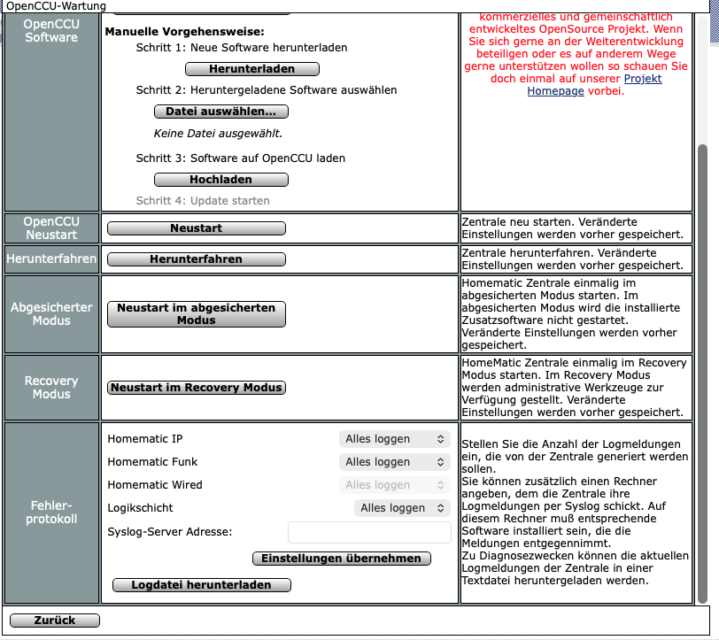

# HmIP-Routing-Analyse vorbereiten

> Diese Funktion ist optional und standardmäßig ausgeschaltet. Ohne Aktivierung verschwindet der Prüfpunkt vollständig aus der Analyse.

## 1. Funktion aktivieren

Im Homematic Analyzer:

1. **Einstellungen** öffnen.
2. **HmIP-Routing analysieren** aktivieren.
3. Die angezeigte Checkliste von oben nach unten abarbeiten.

## 2. HmIP-Logging einschalten

In OpenCCU/RaspberryMatic:

1. **Einstellungen → Systemsteuerung → Zentralen-Wartung** öffnen.
2. Zum Bereich **Fehlerprotokoll** scrollen.
3. Bei **Homematic IP** den Wert **Alles loggen** auswählen.
4. **Einstellungen übernehmen** anklicken.



## 3. Zentrale neu starten

Die Änderung am HmIPServer-Logging wird erst nach einem Neustart zuverlässig aktiv. Die Zentrale anschließend normal neu starten und warten, bis die WebUI wieder erreichbar ist.

## 4. Collector aktualisieren

Den in der Analyzer-Checkliste angezeigten Befehl per SSH auf der CCU ausführen. Der Collector liest maximal die neuesten 250 Zeilen aus:

```text
/var/log/hmserver.log
```

Falls die aktuelle Datei noch nicht vorhanden ist, wird zusätzlich geprüft:

```text
/var/log/hmserver.log.1
```

Die HmIP-Logzeilen werden für den Transport Base64-kodiert. Dadurch können Sonderzeichen aus dem Log das JSON nicht beschädigen.

## 5. Empfang testen

Im Analyzer **Empfang jetzt testen** anklicken. Der letzte Haken wird automatisch gesetzt, wenn:

- der Collector aktuell sendet,
- mindestens eine HmIPServer-Logzeile empfangen wurde,
- die Daten höchstens wenige Minuten alt sind.

Danach:

1. **Analyse** öffnen.
2. **Neu analysieren** anklicken.
3. Den Prüfpunkt **HmIP Routing** auswählen.

## Logging anschließend reduzieren

Nach der Datenerfassung sollte **Homematic IP** wieder auf den vorherigen Wert oder **Nur Fehler protokollieren** gestellt werden. **Alles loggen** erzeugt deutlich mehr Logdaten.

## Collector rückstandslos entfernen

Der genaue Entfernen-Befehl wird in der App angezeigt. Allgemeines Muster:

```bash
curl -fsSL "http://ANALYZER-IP:3001/api/collector/script?url=http%3A%2F%2FANALYZER-IP%3A3001&token=homematic-analyzer-demo-token&mode=uninstall&interval=minute" | sh
```

Entfernt werden ausschließlich:

- der mit `Homematic Analyzer system snapshot` markierte Cronjob,
- `/tmp/homematic-analyzer-collector.log`,
- `/tmp/homematic-analyzer-last-payload.json`.

Andere Cronjobs, CCU-Konfigurationen, Backups und Systemdateien werden nicht verändert.
